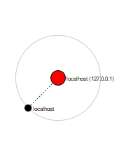

# Nmap Scan Lab 🛡️

## 🔹 Objective
Run Nmap scans against localhost using different modes to identify open ports, services, and potential vulnerabilities.  
The goal is to understand what attackers can see, and how defenders can use this information to strengthen security.

## 🔹 Commands Used
nmap -sV localhost
nmap -T4 -A -v localhost
nmap --script vuln localhost
- `-sV` → Detect service versions  
- `-T4 -A -v` → Intense scan (faster timing, OS detection, script scanning, traceroute, verbose output)  
- `--script vuln` → Run vulnerability detection scripts  

---

## 🔹 Results

### Port Scan

### Intense Scan Output (-T4 -A -v)

### Topology View

### Vulnerability Script Scan

**Summary of detected open ports:**
- **135/tcp open** – MSRPC (Microsoft RPC service)  
- **445/tcp open** – Microsoft-DS (SMB, Server Message Block)  
- **1434/tcp open** – MS-SQL Monitor  
- **1947/tcp open** – Sentinel SRM  
- **3000/tcp open** – PPP  
- **5357/tcp open** – WSDAPI  
- **5432/tcp open** – PostgreSQL database service  
- **7000/tcp open** – AFS3 File Server  
- **8082/tcp open** – BlackIce Alerts  
- **12345/tcp open** – NetBus (historically used as a backdoor Trojan)

**Host script results (from vuln scan):**
- `smb-vuln-ms10-061`: ERROR (could not negotiate connection)  
- `smb-vuln-ms10-054`: false (not vulnerable)  
- `samba-vuln-cve-2012-1182`: connection failed  

---

## 🔹 Analysis
- Several **critical services** (e.g., SMB on port 445, PostgreSQL on 5432) are running and exposed.  
- Attackers could attempt **brute-force attacks** on PostgreSQL or exploit **SMB vulnerabilities** (e.g., WannaCry ransomware targeted SMB).  
- The presence of port **12345 (NetBus)** is especially concerning — it is historically linked to **remote access Trojans/backdoors**, which could allow attackers full control of the system.  
- The **Intense Scan (-T4 -A -v)** provided extra information such as **OS details, TCP sequence prediction, and uptime**, which attackers could use to fingerprint the system.  
- Failed script checks show that while some specific SMB exploits didn’t trigger, the services remain exposed and require attention.  

---

## 🔹 Mitigation
- **Firewalling** → Restrict access to only necessary ports/services.  
- **Disable Unused Services** → Ports like 12345 (NetBus) should not be running at all.  
- **Patch Management** → Keep SMB, PostgreSQL, and other services fully updated to avoid known CVEs.  
- **Intrusion Detection (IDS/IPS)** → Monitor repeated login attempts or suspicious scanning activity.  
- **Principle of Least Privilege** → Limit access to services only to authorised users.  

---

## 🔹 Takeaway
This lab shows how different Nmap modes — from a basic service version scan (`-sV`) to an aggressive **Intense Scan (`-T4 -A -v`)** and vulnerability scripts — can reveal a **lot** about a target system.  
As a defender, regularly scanning your own environment is crucial to **see what attackers see** and close those doors before they are exploited.
### Port Scan

### Intense Scan Output (-T4 -A -v)

### Topology View

### Vulnerability Script Scan

