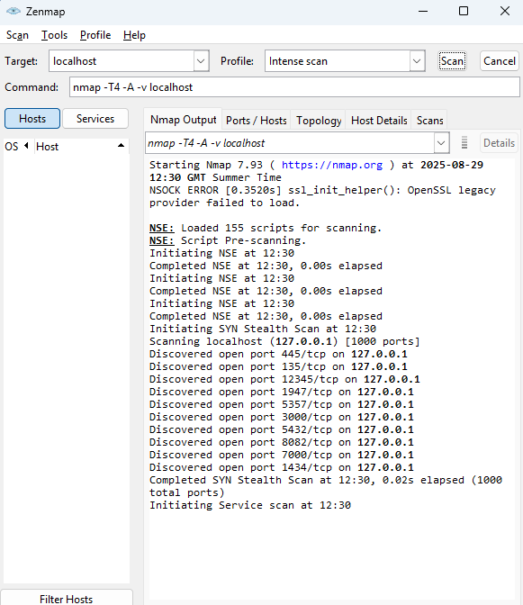
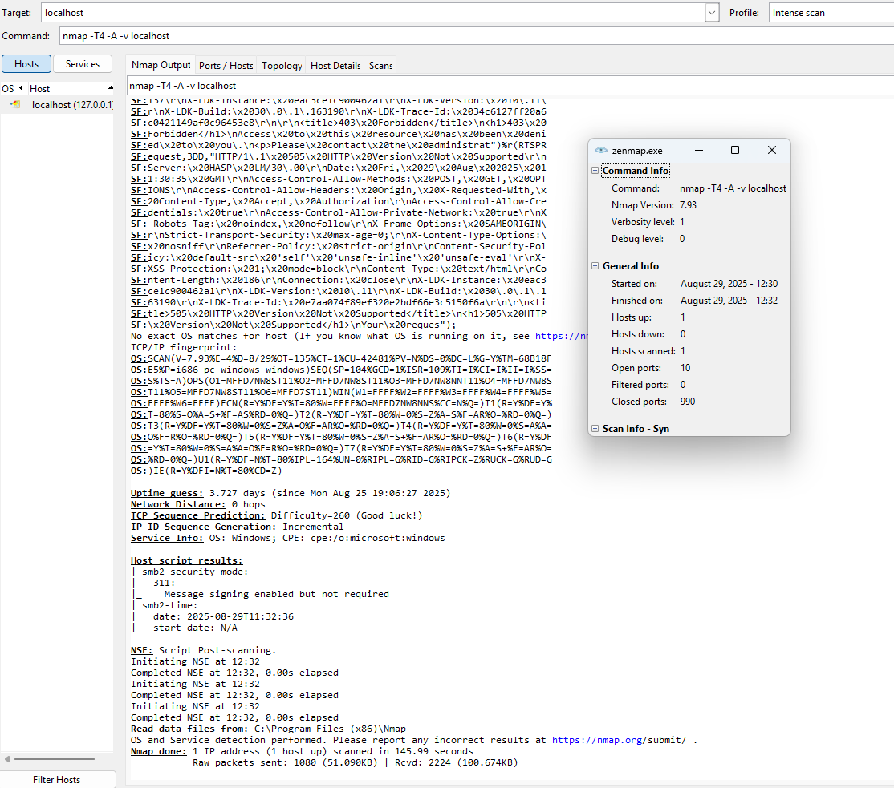
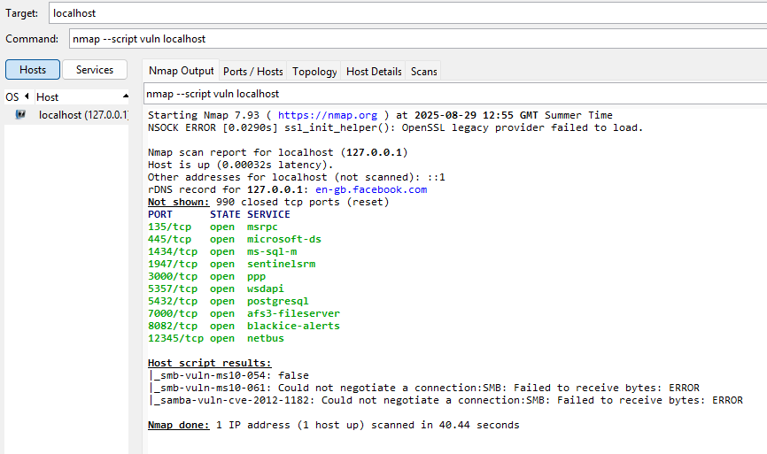

# ⚔️ Nmap Lab – Derek’s Cybersecurity Portfolio

## 🎯 Goal
I wanted to see what an attacker could find if they scanned my machine.  
Nmap is basically the hacker’s torch in the dark — it shows all the doors and windows into a system.  
My job here is to light up those doors, then figure out how to lock them before anyone else walks through.

---

## ⚙️ Commands I Ran
- `nmap -sV localhost` → Quick scan to see service versions.  
- `nmap -T4 -A -v localhost` → Intense scan (OS detection, scripts, traceroute, the full works).  
- `nmap --script vuln localhost` → Tried to pull known vulnerability info (like WannaCry’s SMB exploit).  

---

## 📊 Results

### 🔹 Port Discovery (first sweep)
First, Nmap just showed me what was open. Think of this as **spotting the doors** before checking what’s behind them.  

---

### 🔹 Full Analysis (Intense Scan `-T4 -A -v`)
This stage is where Nmap flexes. It told me the OS, uptime, and even checked SMB (which is how WannaCry spread back in 2017).  
Basically: **not just the doors, but who’s standing inside them and how strong they look.**  

---

### 🔹 Network Topology (Zenmap)
Zenmap gave me a little map of my host. Not flashy here since it’s localhost, but imagine this on a big network — it’s how attackers visualise your infrastructure.  

---

### 🔹 Vulnerability Script Scan
Ran the vuln scripts. Some failed, but the point is: **if SMB is open, attackers will always try WannaCry or EternalBlue-style exploits first.**  

---

## 📝 My Take
- **Open Ports = Attack Surface.** I had SMB (445), SQL, and even an old NetBus port (12345) — that one’s historically linked to backdoors. 🚩  
- **Full Analysis = Recon.** With OS fingerprints and service versions, an attacker could Google CVEs in minutes.  
- **Vuln Scan = Confirmation.** Even if it doesn’t show every exploit, it proves attackers are always probing for low-hanging fruit.  

---

## 🛡️ What I’d Do in Real Life
- Shut down unneeded services (NetBus has zero business being open).  
- Firewall the essentials, don’t let everything through.  
- Patch SMB and keep PostgreSQL locked to trusted users only.  
- Drop in an IDS/IPS to catch brute force attempts before they get anywhere.  

---

✅ Bottom line: Nmap is like putting on x-ray goggles. You don’t just see the outside of a system — you see its bones. And if I can see this much, so can an attacker. My job is to make sure when they try, they find nothing but locked doors.  
